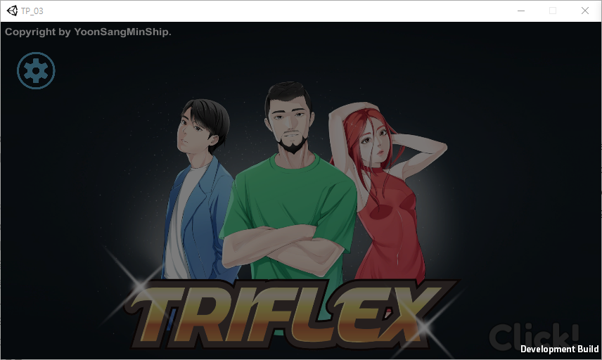
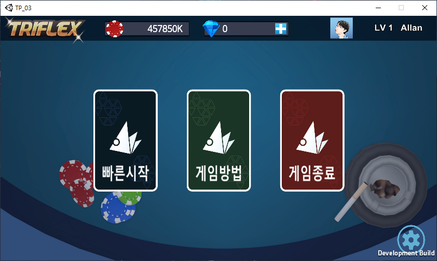
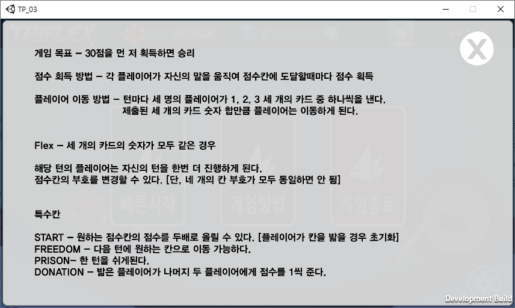
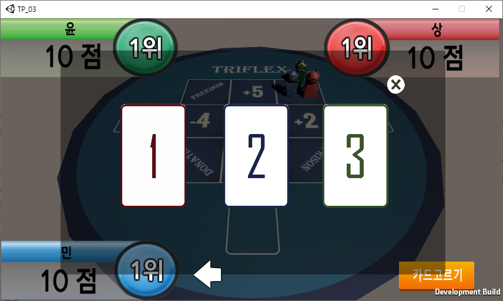
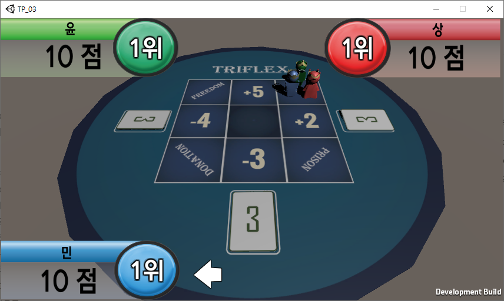
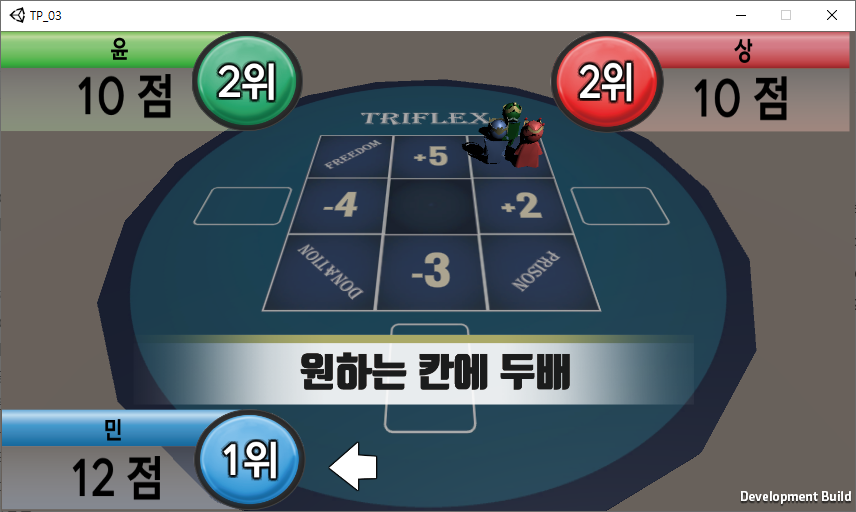
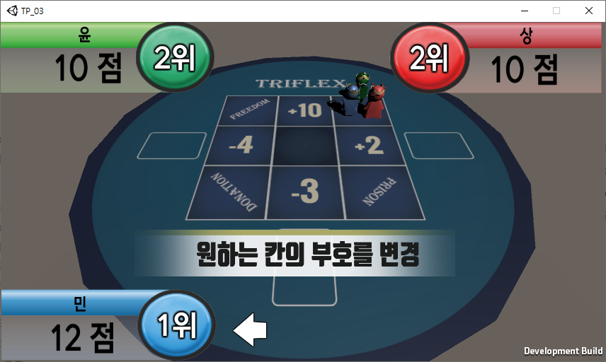
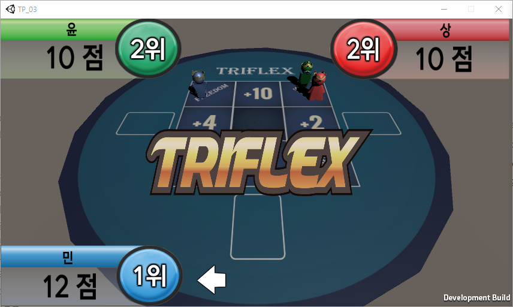

# TriFlex

# 👉개요

## 게임 개요

- **게임 이름 : TriFlex**
- **장르 : 멀티 플레이 전략 보드 게임**
- **사용 도구 : Unity 3D, Photon Unity Networking**
- **목적 : Unity 엔진과 Photon 서버를 이용한 온라인 게임 구현**
- **제작 기간 : 2020.05 - 2020.07**
- **제작 인원 : 4명**

## 게임 이미지

# 👉특징

## 담당 업무

**✔ 게임 기획**

**✔ 게임 시스템 구현**

**✔ 서버 동기화 작업**

## 구현 내용

✔ Photon 서버를 이용한 캐릭터와 플레이턴, 카드 정보 동기화 구현

✔ 플레이어 이름 동기화 구현

✔ RayCasting을 이용한 보드 칸 선택 구현

✔ List자료형을 이용한 보드 구현

✔ 싱글톤 패턴을 이용해 플레이어 정보를 관리 및 동기화하는 gamemanager 클래스 구현

✔ 플레이어 점수와 점수를 보여주는 UI, 승리 조건 구현

✔ UI를 이용한 카드 선택 구현

# 👉참고 링크

- **유튜브 : [https://www.youtube.com/watch?v=bHrag9FbYs8](https://www.youtube.com/watch?v=bHrag9FbYs8)**
- **Git Hub : [https://github.com/yoonsangmin/TeamProject](https://github.com/yoonsangmin/TeamProject)**

## 영상

